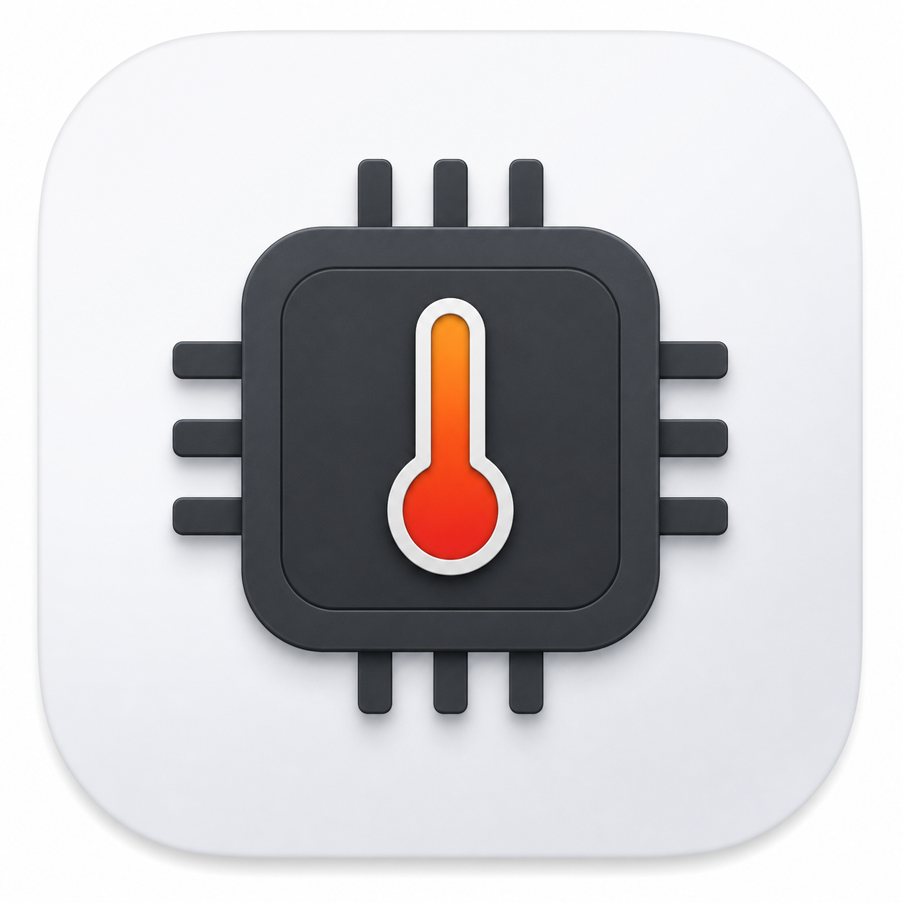
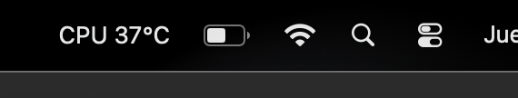

# TemperatureIcon

App nativa minimalista para macOS que vive en la menu bar y muestra la temperatura real del Apple Silicon.



El proyecto Xcode se llama `TemperatureIcon`; la app instalada aparece como `CPU Temperature`.

Formato actual:

```text
CPU 45°C
```

## Captura



Nota: la captura es una franja recortada de la menu bar. La app muestra texto en la barra superior, no abre ventana principal.

## Compatibilidad

- macOS 14 o superior.
- Mac con Apple Silicon.
- Probado localmente en una MacBook Air Apple Silicon donde macOS expuso sensores `PMU tdie*` y `PMU2 tdie*`.
- No esta limitado intencionalmente a M4. El metodo HID/IOKit usado puede funcionar en otros chips Apple Silicon, pero no se garantiza en todos los modelos.
- No compatible con Intel en su estado actual.

## Limitaciones

Apple no ofrece una API publica estable para obtener la temperatura CPU/SoC en grados Celsius en Apple Silicon. Esta app usa rutas HID/IOKit no documentadas.

Eso implica:

- Los nombres de sensores pueden cambiar entre M1, M2, M3, M4 y futuras generaciones.
- La app muestra una lectura representativa de die/SoC, no una temperatura oficial de un core especifico.
- Puede dejar de funcionar si Apple cambia permisos o sensores en una version futura de macOS.
- App Sandbox esta desactivado porque la lectura de sensores HID/IOKit puede fallar dentro del sandbox.

## Estructura

```text
App/
  TemperatureIconApp.swift
Monitoring/
  TemperatureMonitor.swift
Sensors/
  TemperatureReader.swift
  SensorBridge.c
  SensorBridge.h
  TemperatureIcon-Bridging-Header.h
Views/
  ContentView.swift
Assets.xcassets/
```

## Responsabilidades

- `App/TemperatureIconApp.swift`: entrada de la app y `MenuBarExtra`.
- `Monitoring/TemperatureMonitor.swift`: estado actual, timer de 5 segundos y formato de texto.
- `Sensors/TemperatureReader.swift`: selecciona el sensor CPU/SoC.
- `Sensors/SensorBridge.c`: lectura HID/IOKit de bajo nivel.
- `Assets.xcassets`: icono y recursos visuales.

## Ejecutar

Abre:

```text
TemperatureIcon.xcodeproj
```

Selecciona el scheme `TemperatureIcon` y presiona Run.

La app no aparece en el Dock porque usa `LSUIElement`. Debe aparecer solo en la menu bar.

## Privacidad y seguridad

Revision local antes de compartir:

- No hace peticiones de red.
- No usa `URLSession`, sockets ni APIs HTTP.
- No ejecuta comandos externos.
- No lee archivos personales del usuario.
- No usa Keychain.
- No contiene tokens, secretos ni credenciales.
- Solo consulta sensores de temperatura via HID/IOKit y actualiza texto en la menu bar.

## Referencias

- [Stats](https://github.com/exelban/stats) documenta que los sensores CPU/GPU en Apple Silicon son zonas termicas y que Apple cambia las claves entre SoCs.
- [mactop](https://github.com/metaspartan/mactop) usa `IOKit`/`IOHIDEventSystemClient` para monitoreo de Apple Silicon.
- [apple_sensors write-up](https://blog.paul-goldschmidt.de/read-cpu-gpu-chip-temperature-on-m1-m2-m3-macs-apple-silicon-under-macos-sonoma/) muestra el enfoque HID para leer temperaturas en M-series.
